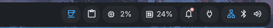

# DankCaffeine

A [DankMaterialShell](https://danklinux.com) plugin that prevents your screen from going idle — like the GNOME Caffeine extension.

---



## Features

- **DankBar widget** — coffee icon in your bar, click to toggle. Highlights when active.
- **Persistent state** — optionally restores caffeine state across restarts.
- **Zero dependencies** — uses `systemd-inhibit` under the hood, no extra packages needed.

## Installation

### From the DMS Plugin Manager

Search for "DankCaffeine" in the DMS plugin browser, or:

```bash
dms plugins install dankCaffeine
```

### Manual

```bash
git clone https://github.com/firemonster612/DankCaffeine.git \
    ~/.config/DankMaterialShell/plugins/DankCaffeine
dms restart
dms ipc call plugins enable dankCaffeine
```

## Configuration

| Setting | Default | Description |
|---------|---------|-------------|
| Caffeine Active | Off | Current toggle state |
| Restore on startup | On | Re-enable caffeine automatically if it was active when DMS last closed |

## Requirements

- DankMaterialShell >= 1.2.0
- `systemd` (uses `systemd-inhibit`)
- Any Wayland compositor (niri, Hyprland, Sway, labwc, etc.)

## Permissions

| Permission | Reason |
|------------|--------|
| `settings_read` | Read caffeine state and user preferences |
| `settings_write` | Persist toggle state across restarts |
| `process` | Run `systemd-inhibit` to prevent idle |

## Contributing

Bug reports, feature requests, and pull requests are welcome.

## License

MIT

## Author

[firemonster612](https://github.com/firemonster612)
